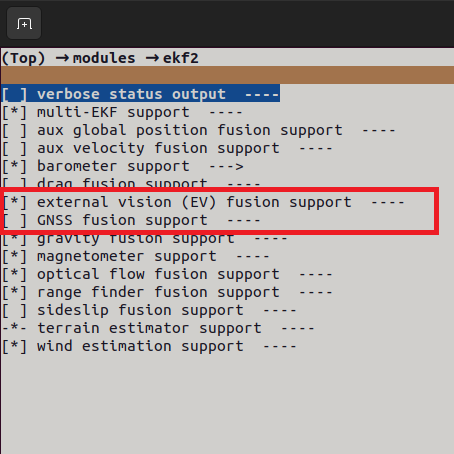

# Firmware setup

The application was developed and tested using PX4 v1.15.2.

This guide explains how to setup the firmware to work in this application.

## 1. Download the PX4 source code

PX4 source code can be found in this [repository](https://github.com/PX4/PX4-Autopilot).

To download the repository run the following command:

```bash
git clone https://github.com/PX4/PX4-Autopilot.git --recursive
```

This command will download the latest verison of the firmware, if you want to download a previous version refer to this [guide](https://docs.px4.io/main/en/contribute/git_examples.html#get-a-specific-release).

If you want to execute some simulation you have to download the developer toolchain, the procedure is explained in this [guide](https://docs.px4.io/main/en/dev_setup/dev_env.html).

## 2. Modify the firmware

Go into the previously downloaded folder and execute:

```bash
make holybro_kakuteh7_default boardconfig
```
(if you have a different board substitute *kakuteh7* and *holybro* with your board and manufacturer names).

This command will open a GUI to modify all PX4 characteristics. Inside the GUI open ***modules -> ekf2***

Here, enable the *external vision(EV) fusion support* and disable the *GNSS fusion support* as shown below



This are the only two fundamental parameters that have to be set like this, the others are hardware dependent.

Save and exit.

## 3. Upload the code 

To upload the code you have to connect to the flight controller with a serial connection, then (save and exit from GUI if you didn't) go into the PX4 source code folder and execute this command:

```bash
make holybro_kakuteh7_default upload
```
(if you have a different board substitute *kakuteh7* and *holybro* with your board and manufacturer names).

This command will build and upload the firmware to the flight controller.

#### The firmware setup is complete, the next step is upload the parser, the instructions are [here](https://github.com/GiacomoCaciagli/Software_Design_For_UAV_Applications_in_GNSS-DENIED_Environments/blob/main/libapq8086-io/README.md).
